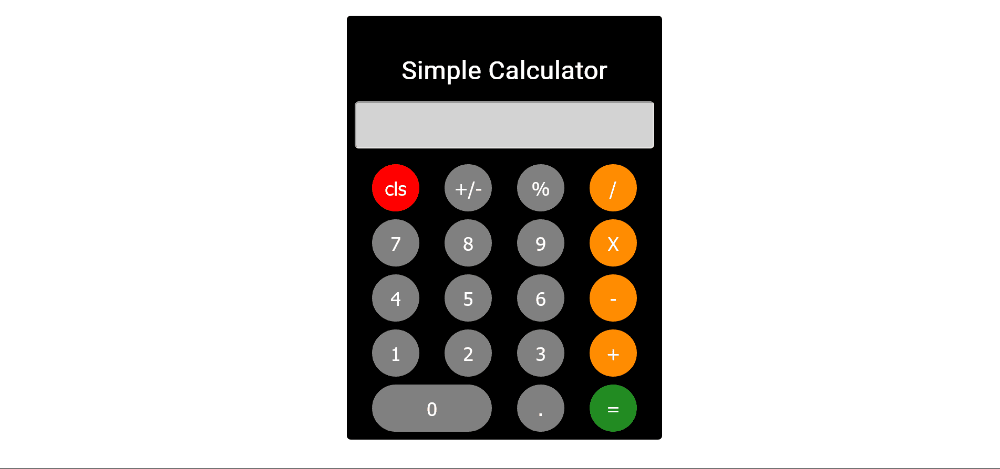

### The challenge

Users should be able to:

- Complete simple calculations using the app
- Restart the calculator
- Combine mathematical operations on the calculator

### Screenshot

### Links

- Solution URL: [https://github.com/JulianIfesiokwu/Simple-Calculator](https://github.com/JulianIfesiokwu/Simple-Calculator)
- Live Site URL: [https://julianifesiokwu.github.io/Simple-Calculator/](https://julianifesiokwu.github.io/Simple-Calculator/)

### Built with

- HTML
- CSS
- Flexbox
- JavaScript
